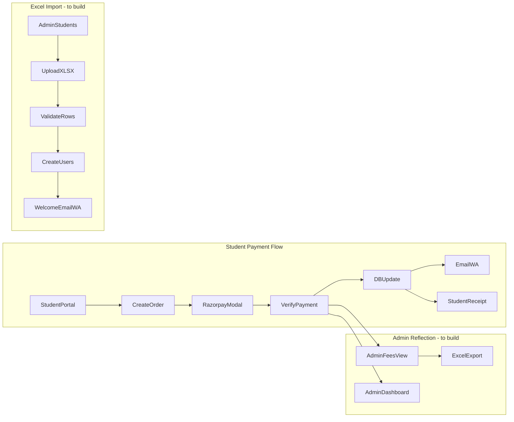
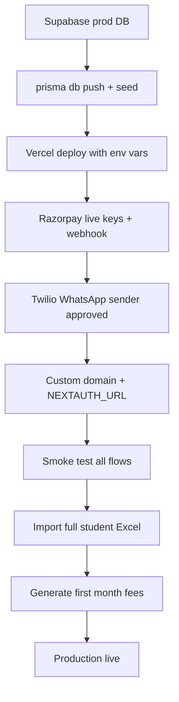

# Taal Foundation — Full ERP + Production Deployment Plan

## Current state (what you already have)

The app is a **Next.js 15 full-stack ERP** with working modules for students, fees, attendance, events, uniforms, announcements, and schedule. Core integrations are already wired:


| Capability                                 | Status                                                         | Key files                                                                                                                                                                                                                                                                                |
| ------------------------------------------ | -------------------------------------------------------------- | ---------------------------------------------------------------------------------------------------------------------------------------------------------------------------------------------------------------------------------------------------------------------------------------- |
| Student portal + admin portal              | Working                                                        | `[app/admin/](app/admin/)`, `[app/student/](app/student/)`                                                                                                                                                                                                                               |
| Razorpay checkout + signature verify       | Working                                                        | `[lib/razorpay.ts](lib/razorpay.ts)`, `[app/api/fees/create-order/route.ts](app/api/fees/create-order/route.ts)`, `[app/api/fees/verify-payment/route.ts](app/api/fees/verify-payment/route.ts)`, `[components/student/StudentFeesClient.tsx](components/student/StudentFeesClient.tsx)` |
| Payment email + WhatsApp confirmation      | Working                                                        | `[lib/mailer.ts](lib/mailer.ts)`, `[lib/whatsapp.ts](lib/whatsapp.ts)`                                                                                                                                                                                                                   |
| Fee generation + WhatsApp reminders (cron) | Working                                                        | `[vercel.json](vercel.json)`, `[app/api/cron/generate-fees/route.ts](app/api/cron/generate-fees/route.ts)`, `[app/api/cron/fee-reminders/route.ts](app/api/cron/fee-reminders/route.ts)`                                                                                                 |
| PDF fee receipt                            | Working                                                        | `[app/api/student/fees/[id]/receipt/route.ts](app/api/student/fees/[id]/receipt/route.ts)`                                                                                                                                                                                               |
| Excel import/export                        | **Missing**                                                    | —                                                                                                                                                                                                                                                                                        |
| Admin real-time payment reflection         | **Partial** (page reload only; no webhook; no manual cash pay) | `[components/admin/FeesClient.tsx](components/admin/FeesClient.tsx)`                                                                                                                                                                                                                     |
| Batch management UI                        | **Missing** (API exists)                                       | `[app/api/admin/batches/route.ts](app/api/admin/batches/route.ts)`                                                                                                                                                                                                                       |
| Student edit / bulk import UI              | **Missing**                                                    | `[app/api/admin/students/[id]/route.ts](app/api/admin/students/[id]/route.ts)`                                                                                                                                                                                                           |





---

## Phase 1 — Production foundation (do this first)

### 1.1 External services setup

Create/configure these accounts before deploying:

1. **Supabase** — PostgreSQL database (already referenced in `[prisma/schema.prisma](prisma/schema.prisma)`)
  - Create project → get `DATABASE_URL` (pooler, port **6543**) and `DIRECT_URL` (direct, port **5432**)
  - Optional: Supabase Storage for profile photos / uniform images
2. **Vercel** — connect GitHub repo, framework = Next.js
3. **Razorpay** — switch from test keys to **live** keys; enable webhooks
4. **Twilio** — WhatsApp Business API (approved sender number)
5. **SMTP** — Gmail App Password, Resend, or SendGrid for `[lib/mailer.ts](lib/mailer.ts)`

### 1.2 Environment variables (all required in Vercel)

Create `[.env.local.example](.env.local.example)` (currently missing from repo) with:

```
DATABASE_URL=          # Supabase pooler (6543)
DIRECT_URL=            # Supabase direct (5432)
NEXTAUTH_SECRET=       # openssl rand -base64 32
NEXTAUTH_URL=          # https://your-domain.vercel.app
RAZORPAY_KEY_ID=
RAZORPAY_KEY_SECRET=
NEXT_PUBLIC_RAZORPAY_KEY_ID=
EMAIL_SERVER_HOST=
EMAIL_SERVER_PORT=
EMAIL_SERVER_USER=
EMAIL_SERVER_PASSWORD=
EMAIL_FROM=
TWILIO_ACCOUNT_SID=
TWILIO_AUTH_TOKEN=
TWILIO_WHATSAPP_FROM=
CRON_SECRET=           # openssl rand -base64 32
```

### 1.3 Database bootstrap (one-time)

```bash
# Against production DB (use DIRECT_URL)
npx prisma db push
npm run db:seed   # creates admin login from prisma/seed.ts
```

**Recommendation:** adopt `prisma migrate` for future schema changes instead of `db push` in production.

### 1.4 Code fixes before deploy


| File                                       | Change                                                                                |
| ------------------------------------------ | ------------------------------------------------------------------------------------- |
| `[next.config.ts](next.config.ts)`         | Add production domain to `serverActions.allowedOrigins`                               |
| `[netlify.toml](netlify.toml)`             | Delete or replace — current config targets static `dist/` SPA and will break this app |
| `[.env.local.example](.env.local.example)` | Add committed template (no secrets)                                                   |
| `[README.md](README.md)`                   | Document Vercel deploy + env checklist                                                |


### 1.5 Vercel deploy steps

1. Push code to GitHub
2. Import repo in Vercel → auto-detect Next.js
3. Paste all env vars from section 1.2
4. Deploy — `[vercel.json](vercel.json)` cron jobs activate automatically (requires Vercel plan with Cron support)
5. Set custom domain → update `NEXTAUTH_URL` and Razorpay webhook URL
6. In Razorpay Dashboard → Webhooks → point to `https://your-domain/api/fees/webhook`

---

## Phase 2 — Payment gateway hardening + admin reflection

**Goal:** Student pays → admin sees it immediately, with confirmation on both sides.

### 2.1 Add Razorpay webhook (reliability)

Today payment status only updates when the student's browser calls `[verify-payment](app/api/fees/verify-payment/route.ts)`. If the tab closes early, the fee may stay PENDING.

**Build:** `app/api/fees/webhook/route.ts`

- Verify Razorpay webhook signature
- On `payment.captured`: mark fee PAID, store `razorpayPaymentId`, send email/WhatsApp
- Idempotent: skip if already PAID

### 2.2 Admin payment reflection

**Update `[components/admin/FeesClient.tsx](components/admin/FeesClient.tsx)`:**

- Show `razorpayPaymentId`, `paidDate`, payment method badge (Online / Cash / Waived)
- Add **"Mark as paid (cash/UPI offline)"** action → new API action `markPaid` in `[app/api/admin/fees/route.ts](app/api/admin/fees/route.ts)`
- Optional: poll or `router.refresh()` every 30s on fees page, or use React Query invalidation after student payment

**Update `[components/admin/AdminDashboardClient.tsx](components/admin/AdminDashboardClient.tsx)`:**

- Add "Recent payments" table (last 10 PAID fees with student name, amount, date)
- Refresh collected-this-month stat when payments land

### 2.3 Student-side confirmation polish

**Update `[components/student/StudentFeesClient.tsx](components/student/StudentFeesClient.tsx)`:**

- Success toast + status badge update without full page reload
- Disable pay button after successful verify
- Show receipt download immediately after PAID

---

## Phase 3 — WhatsApp fee reminders (production-ready)

Already implemented in `[app/api/cron/fee-reminders/route.ts](app/api/cron/fee-reminders/route.ts)` and admin "Send reminders" in `[app/api/admin/fees/route.ts](app/api/admin/fees/route.ts)`.

### 3.1 Twilio production checklist

1. Register WhatsApp Business sender in Twilio Console
2. Set `TWILIO_WHATSAPP_FROM` to approved number (E.164)
3. For India: ensure message templates comply with WhatsApp Business policy (or use approved template IDs if required)
4. Test with 2–3 real student numbers before go-live

### 3.2 Wire missing WhatsApp on annual increment

`[lib/whatsapp.ts](lib/whatsapp.ts)` has `annualIncrementMessage` but `[app/api/cron/annual-increment/route.ts](app/api/cron/annual-increment/route.ts)` only sends email. Add WhatsApp send there.

### 3.3 Reminder schedule (already in vercel.json)


| Cron               | Schedule              | Action                               |
| ------------------ | --------------------- | ------------------------------------ |
| `generate-fees`    | 1st of month, 9:00 AM | Create monthly fees + email notice   |
| `fee-reminders`    | Every Monday, 9:00 AM | Email + WhatsApp for PENDING/OVERDUE |
| `annual-increment` | Jan 1 midnight        | ₹100 increment + notify              |


Ensure `CRON_SECRET` is set in Vercel — middleware blocks cron routes without it.

---

## Phase 4 — Excel import + auto-export (your chosen approach)

Add dependency: `exceljs` (read + write `.xlsx`).

### 4.1 Student Excel import

**Build:** `app/api/admin/students/import/route.ts` + UI in `[components/admin/StudentsClient.tsx](components/admin/StudentsClient.tsx)`

**Excel template columns (row 1 = headers):**


| name | email | phone | parentName | parentPhone | address | batchName | monthlyFee | dateOfBirth |
| ---- | ----- | ----- | ---------- | ----------- | ------- | --------- | ---------- | ----------- |


**Import logic:**

1. Admin uploads `.xlsx` via `FormData`
2. Parse rows with `exceljs`
3. Validate: required fields, unique email, batch exists (or auto-create batch option)
4. For each valid row: call same logic as `[POST /api/admin/students](app/api/admin/students/route.ts)` — create user, fee structure, welcome email + WhatsApp
5. Return summary: `{ created: 45, skipped: 3, errors: [{ row: 12, reason: "duplicate email" }] }`

**UI:**

- "Download template" button (generates empty `.xlsx` with headers + 1 example row)
- "Import students" upload button with progress + error report table

### 4.2 Auto-export spreadsheets

**Build export API routes:**


| Route                                                  | Data                                 | Trigger               |
| ------------------------------------------------------ | ------------------------------------ | --------------------- |
| `GET /api/admin/export/students`                       | All students + batch + fee structure | Admin "Export" button |
| `GET /api/admin/export/fees?month=2026-06&status=PAID` | Fee ledger                           | Admin fees page       |
| `GET /api/admin/export/attendance?batchId=&from=&to=`  | Attendance matrix                    | Admin attendance page |


**Auto-export on payment (optional enhancement):**

- After `verify-payment` or webhook: append row to a monthly fees ledger sheet stored in Supabase Storage, OR simply rely on the export endpoint (simpler, recommended first)

**Admin UI:** Add "Export to Excel" buttons on Students, Fees, and Attendance pages.

---

## Phase 5 — Complete ERP admin UI (easy database updates through UI)

These APIs exist but have no admin UI — building these removes the need to touch the database directly.

### 5.1 Batch management (new page)

- **Create:** `app/admin/batches/page.tsx` + `BatchesClient.tsx`
- Wire to existing `[app/api/admin/batches/route.ts](app/api/admin/batches/route.ts)`
- CRUD: name, schedule text, instructor, capacity, active toggle
- Used by student form batch dropdown and attendance batch selector

### 5.2 Student edit form

- Add "Edit" modal on `[StudentsClient.tsx](components/admin/StudentsClient.tsx)` and/or edit section on `[app/admin/students/[id]/page.tsx](app/admin/students/[id]/page.tsx)`
- Wire to existing `PATCH` in `[app/api/admin/students/[id]/route.ts](app/api/admin/students/[id]/route.ts)`
- Editable: name, phone, parent info, address, batch, monthly fee, active status, date of birth

### 5.3 Fees admin actions

Extend `[app/api/admin/fees/route.ts](app/api/admin/fees/route.ts)`:

- `markPaid` — cash/offline payment with optional reference note
- `createOneOff` — ad-hoc fee (uniform, event, other)
- Server-side filters: month, student, status (replace 200-record cap in UI with paginated query)

### 5.4 Events, uniforms, schedule, announcements


| Module        | Build                                                                       |
| ------------- | --------------------------------------------------------------------------- |
| Events        | Edit modal; registrant list drawer; optional-event fee on registration      |
| Uniforms      | Edit/delete catalog items; decrement stock on CONFIRMED order; cancel order |
| Schedule      | Edit modal; week calendar view (stretch goal)                               |
| Announcements | Edit title/content; show batch name instead of raw ID                       |


### 5.5 Attendance reports

- Monthly % per student per batch on admin attendance page
- Export to Excel (Phase 4.2)

---

## Phase 6 — Pre-launch testing checklist

Run through this sequence on **staging** (Vercel preview + Supabase staging DB) before switching Razorpay to live:

1. Admin login → create batch → add student manually → student receives welcome email/WhatsApp
2. Import 5 students from Excel → verify error handling on duplicate email
3. Generate monthly fees → student sees fee in portal
4. Pay with Razorpay test card → verify PAID on admin fees page + dashboard + student receipt
5. Mark one fee paid offline from admin
6. Send manual reminders → confirm WhatsApp delivery
7. Wait for / manually trigger cron endpoints with `CRON_SECRET`
8. Mark attendance → export attendance Excel
9. Create event → verify mandatory fees auto-generated
10. Student registers for optional event → admin sees registrant

---

## Phase 7 — Go-live sequence




**Day-1 operations:**

1. Import all existing students via Excel
2. Verify each student can log in (credentials from welcome email)
3. Generate current month's fees
4. Announce portal URL to parents/students

---

## Recommended build order (priority)


| Priority | Task                                                           | Effort   |
| -------- | -------------------------------------------------------------- | -------- |
| P0       | Vercel deploy + env + DB + remove bad Netlify config           | 0.5 day  |
| P0       | Razorpay webhook + admin mark-paid + dashboard recent payments | 1 day    |
| P1       | Excel student import + template download                       | 1 day    |
| P1       | Excel export (students, fees, attendance)                      | 1 day    |
| P1       | Batch management page + student edit UI                        | 1 day    |
| P2       | Twilio production setup + annual increment WhatsApp            | 0.5 day  |
| P2       | Events/uniforms/schedule edit UIs                              | 1–2 days |
| P3       | Attendance reports, stock decrement, calendar view             | 1–2 days |


**Total estimate:** ~7–10 dev days to full production ERP with all items you listed.

---

## Files you will create or heavily modify

**New files:**

- `app/api/fees/webhook/route.ts`
- `app/api/admin/students/import/route.ts`
- `app/api/admin/export/students/route.ts`
- `app/api/admin/export/fees/route.ts`
- `app/api/admin/export/attendance/route.ts`
- `app/admin/batches/page.tsx`
- `components/admin/BatchesClient.tsx`
- `lib/excel.ts` (shared parse/generate helpers)
- `.env.local.example`

**Modify:**

- `[components/admin/FeesClient.tsx](components/admin/FeesClient.tsx)`
- `[components/admin/StudentsClient.tsx](components/admin/StudentsClient.tsx)`
- `[components/admin/AdminDashboardClient.tsx](components/admin/AdminDashboardClient.tsx)`
- `[app/api/admin/fees/route.ts](app/api/admin/fees/route.ts)`
- `[app/api/cron/annual-increment/route.ts](app/api/cron/annual-increment/route.ts)`
- `[next.config.ts](next.config.ts)`
- Delete `[netlify.toml](netlify.toml)`

## **Your steps to go live on Vercel**

1. **Supabase** — create project, set `DATABASE_URL` (pooler port 6543) and `DIRECT_URL` (5432)
2. **Push schema:** `npx prisma db push` then `npm run db:seed`
3. **Vercel** — import repo, add all vars from `.env.local.example`
4. Set `NEXTAUTH_URL` and `ALLOWED_ORIGINS` to your production domain
5. **Razorpay** — live keys + webhook → `https://your-domain/api/fees/webhook`
6. **Twilio** — approved WhatsApp sender in `TWILIO_WHATSAPP_FROM`
7. **Day 1:** Admin → Batches → Import students (Excel) → Generate monthly fees

